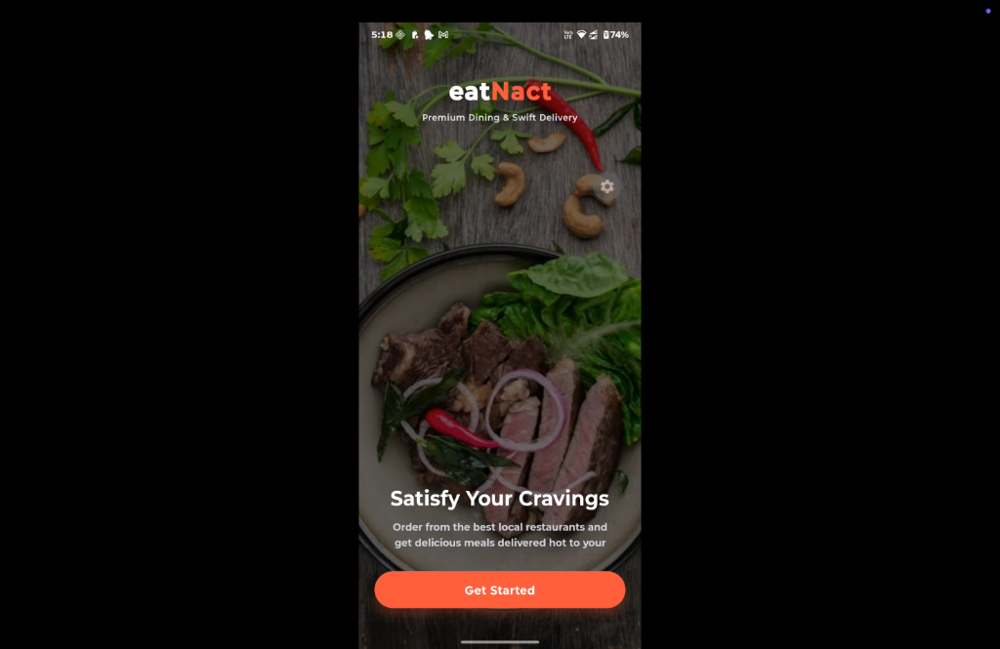
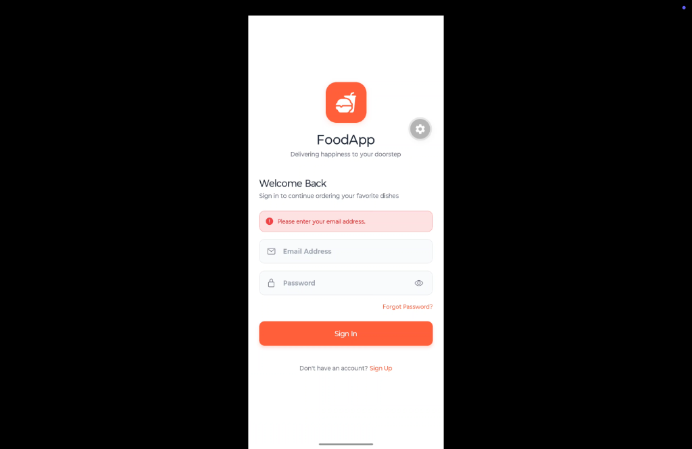

# FoodApp

A high-fidelity Food Delivery mobile application built with React Native, Expo SDK 55, and React Navigation v7.

## Demo Video and Screenshots

Below is the walkthrough video showcasing the user flows:

<video src="./assets/app-demo.mp4" width="100%" controls>
  Your browser does not support the video tag.
</video>

Note: You can replace the video path above with your own mp4 file.

### App Screenshots

  
  

Note: You can replace the screenshot image paths above with your own image files.

## Features

* Global Cart Context: Seamless addition, removal, and quantity synchronization of menu items across screens using React Context.
* Premium Search Screen: Quick food and beverage lookups with category chips and direct Add to Cart capability.
* Custom Navigation Drawer: Interactive sidebar drawer panel rendering customized user cards (initials badge, name, email).
* Persistent Sessions: Secured mock login flow that preserves authentication states across app reloads via AsyncStorage.
* Universal Deep Linking: External link routing mapping paths like foodapp://restaurant/:restaurant directly to restaurant detail views.
* Styled UI Aesthetics: Built with custom colors, typography, micro-interactions, and status indicators.

## Tech Stack

* Framework: React Native (Expo SDK 55)
* Language: TypeScript
* Navigation: React Navigation v7 (Stack, Bottom Tabs, Drawer)
* Persistence: AsyncStorage
* Icons: @expo/vector-icons (Ionicons)
* Package Manager: Bun or NPM

## Getting Started

### Prerequisites

Ensure you have Node.js installed, along with either NPM or Bun.

### Installation

1. Clone the repository:
   git clone git@github.com:crazy-titan/foodApp-navigationReact.git
   cd foodApp-navigationReact

2. Install dependencies:
   bun install

### Running the App

Start the Expo Development Server:
bun start

Use the Expo Go app or a simulator (iOS or Android) to preview the app.

## Testing Deep Links

Once the development server is active, you can test universal deep linking capabilities:

* iOS Simulator:
  npx uri-scheme open "foodapp://restaurant/Fasoos" --ios

* Android Emulator:
  npx uri-scheme open "foodapp://restaurant/Fasoos" --android
